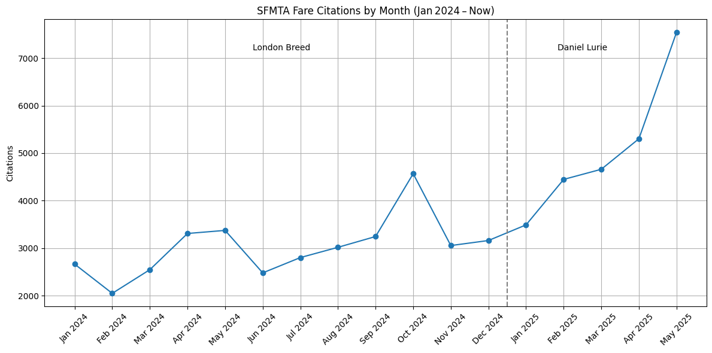
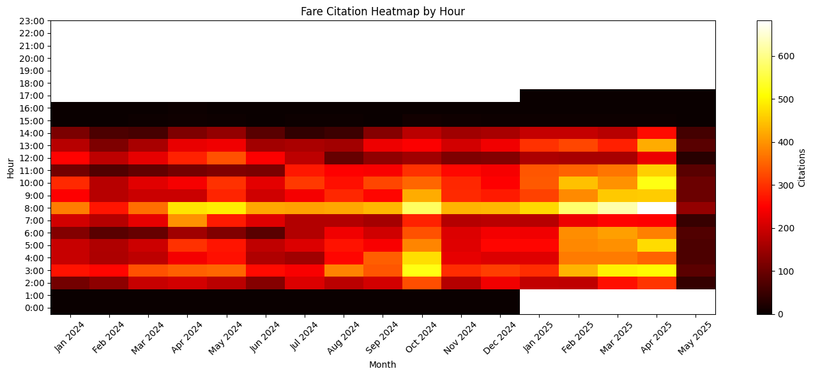
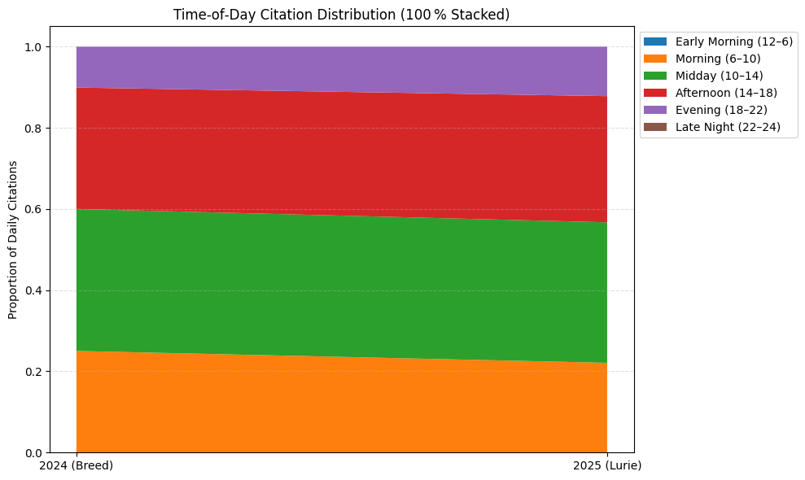
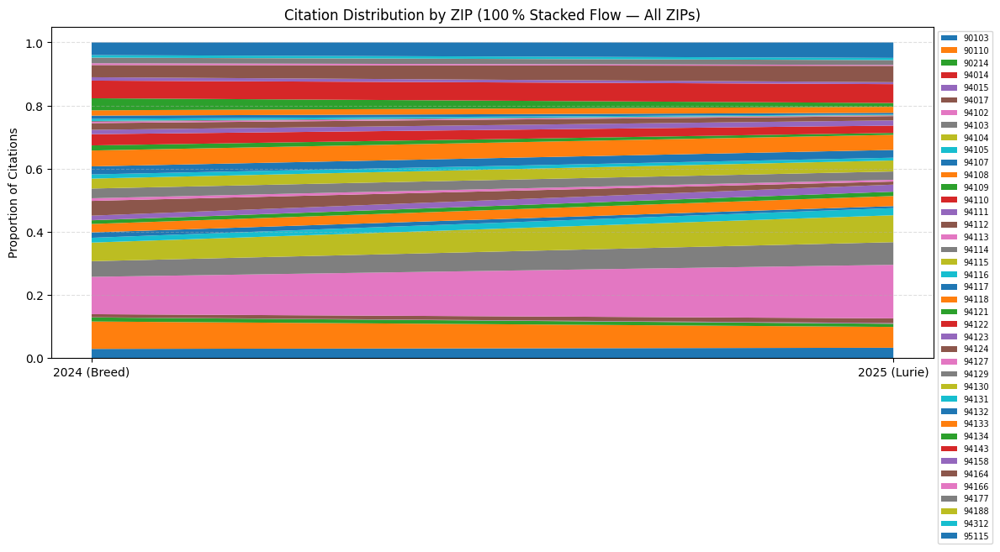
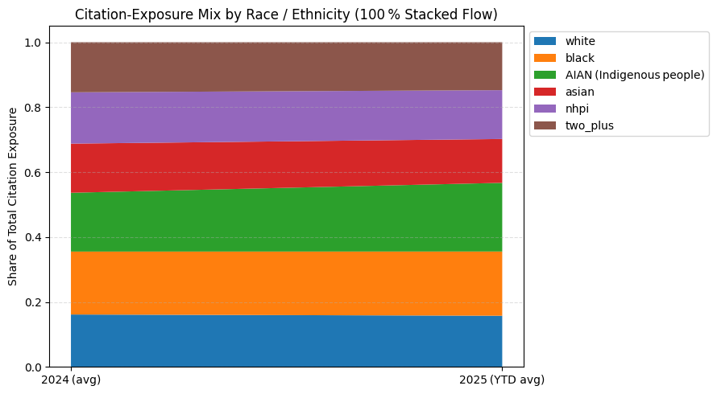

## Research: Muni Ticketing Analysis
This Jupyter notebook contains the analysis of Muni ticketing data. It includes geocoding, demographic analysis, and visualizations of citation trends.  
  
The implications of the analysis are that the mayor's agressive strategy of mass arrests and mass ticketing are disproportionately affecting low-income neighborhoods and communities of color. Citations are up significantly since Lurie took office, with the new enforcement disproportionately targeting BIPOC communities. The analysis also shows that the new administration is focusing on different neighborhoods than the previous administration, with a shift in enforcement patterns away from the Tenderloin and towards the Bayview and Excelsior neighborhoods. The Mission is also seeing a significant increase in citations, along with the very public spectacle of mass arrests of dozens and hundreds of people with almost all the cases being thrown out due to a lack of any evidence.  

--- 


```python
!pip install pandas matplotlib jupyterlab_widgets ipympl numpy scipy geopy tqdm census us

import os, getpass, IPython
%env CENSUS_KEY=


```

    Requirement already satisfied: pandas in /usr/local/lib/python3.8/site-packages (2.0.3)
    Requirement already satisfied: matplotlib in /usr/local/lib/python3.8/site-packages (3.7.5)
    Requirement already satisfied: jupyterlab_widgets in /usr/local/lib/python3.8/site-packages (3.0.15)
    Requirement already satisfied: ipympl in /usr/local/lib/python3.8/site-packages (0.9.3)
    Requirement already satisfied: numpy in /usr/local/lib/python3.8/site-packages (1.24.4)
    Requirement already satisfied: scipy in /usr/local/lib/python3.8/site-packages (1.10.1)
    Requirement already satisfied: geopy in /usr/local/lib/python3.8/site-packages (2.4.1)
    Requirement already satisfied: tqdm in /usr/local/lib/python3.8/site-packages (4.67.1)
    Requirement already satisfied: census in /usr/local/lib/python3.8/site-packages (0.8.24)
    Requirement already satisfied: us in /usr/local/lib/python3.8/site-packages (3.2.0)
    Requirement already satisfied: python-dateutil>=2.8.2 in /usr/local/lib/python3.8/site-packages (from pandas) (2.9.0.post0)
    Requirement already satisfied: pytz>=2020.1 in /usr/local/lib/python3.8/site-packages (from pandas) (2025.2)
    Requirement already satisfied: tzdata>=2022.1 in /usr/local/lib/python3.8/site-packages (from pandas) (2025.2)
    Requirement already satisfied: contourpy>=1.0.1 in /usr/local/lib/python3.8/site-packages (from matplotlib) (1.1.1)
    Requirement already satisfied: cycler>=0.10 in /usr/local/lib/python3.8/site-packages (from matplotlib) (0.12.1)
    Requirement already satisfied: fonttools>=4.22.0 in /usr/local/lib/python3.8/site-packages (from matplotlib) (4.57.0)
    Requirement already satisfied: kiwisolver>=1.0.1 in /usr/local/lib/python3.8/site-packages (from matplotlib) (1.4.7)
    Requirement already satisfied: packaging>=20.0 in /usr/local/lib/python3.8/site-packages (from matplotlib) (25.0)
    Requirement already satisfied: pillow>=6.2.0 in /usr/local/lib/python3.8/site-packages (from matplotlib) (10.4.0)
    Requirement already satisfied: pyparsing>=2.3.1 in /usr/local/lib/python3.8/site-packages (from matplotlib) (3.1.4)
    Requirement already satisfied: importlib-resources>=3.2.0 in /usr/local/lib/python3.8/site-packages (from matplotlib) (6.4.5)
    Requirement already satisfied: ipython<9 in /usr/local/lib/python3.8/site-packages (from ipympl) (8.12.3)
    Requirement already satisfied: ipython-genutils in /usr/local/lib/python3.8/site-packages (from ipympl) (0.2.0)
    Requirement already satisfied: traitlets<6 in /usr/local/lib/python3.8/site-packages (from ipympl) (5.14.3)
    Requirement already satisfied: ipywidgets<9,>=7.6.0 in /usr/local/lib/python3.8/site-packages (from ipympl) (8.1.7)
    Requirement already satisfied: geographiclib<3,>=1.52 in /usr/local/lib/python3.8/site-packages (from geopy) (2.0)
    Requirement already satisfied: requests>=1.1.0 in /usr/local/lib/python3.8/site-packages (from census) (2.32.3)
    Requirement already satisfied: jellyfish in /usr/local/lib/python3.8/site-packages (from us) (1.1.3)
    Requirement already satisfied: zipp>=3.1.0 in /usr/local/lib/python3.8/site-packages (from importlib-resources>=3.2.0->matplotlib) (3.20.2)
    Requirement already satisfied: backcall in /usr/local/lib/python3.8/site-packages (from ipython<9->ipympl) (0.2.0)
    Requirement already satisfied: decorator in /usr/local/lib/python3.8/site-packages (from ipython<9->ipympl) (5.2.1)
    Requirement already satisfied: jedi>=0.16 in /usr/local/lib/python3.8/site-packages (from ipython<9->ipympl) (0.19.2)
    Requirement already satisfied: matplotlib-inline in /usr/local/lib/python3.8/site-packages (from ipython<9->ipympl) (0.1.7)
    Requirement already satisfied: pickleshare in /usr/local/lib/python3.8/site-packages (from ipython<9->ipympl) (0.7.5)
    Requirement already satisfied: prompt-toolkit!=3.0.37,<3.1.0,>=3.0.30 in /usr/local/lib/python3.8/site-packages (from ipython<9->ipympl) (3.0.51)
    Requirement already satisfied: pygments>=2.4.0 in /usr/local/lib/python3.8/site-packages (from ipython<9->ipympl) (2.19.1)
    Requirement already satisfied: stack-data in /usr/local/lib/python3.8/site-packages (from ipython<9->ipympl) (0.6.3)
    Requirement already satisfied: typing-extensions in /usr/local/lib/python3.8/site-packages (from ipython<9->ipympl) (4.13.2)
    Requirement already satisfied: pexpect>4.3 in /usr/local/lib/python3.8/site-packages (from ipython<9->ipympl) (4.9.0)
    Requirement already satisfied: comm>=0.1.3 in /usr/local/lib/python3.8/site-packages (from ipywidgets<9,>=7.6.0->ipympl) (0.2.2)
    Requirement already satisfied: widgetsnbextension~=4.0.14 in /usr/local/lib/python3.8/site-packages (from ipywidgets<9,>=7.6.0->ipympl) (4.0.14)
    Requirement already satisfied: six>=1.5 in /usr/local/lib/python3.8/site-packages (from python-dateutil>=2.8.2->pandas) (1.17.0)
    Requirement already satisfied: charset-normalizer<4,>=2 in /usr/local/lib/python3.8/site-packages (from requests>=1.1.0->census) (3.4.2)
    Requirement already satisfied: idna<4,>=2.5 in /usr/local/lib/python3.8/site-packages (from requests>=1.1.0->census) (3.10)
    Requirement already satisfied: urllib3<3,>=1.21.1 in /usr/local/lib/python3.8/site-packages (from requests>=1.1.0->census) (2.2.3)
    Requirement already satisfied: certifi>=2017.4.17 in /usr/local/lib/python3.8/site-packages (from requests>=1.1.0->census) (2025.4.26)
    Requirement already satisfied: parso<0.9.0,>=0.8.4 in /usr/local/lib/python3.8/site-packages (from jedi>=0.16->ipython<9->ipympl) (0.8.4)
    Requirement already satisfied: ptyprocess>=0.5 in /usr/local/lib/python3.8/site-packages (from pexpect>4.3->ipython<9->ipympl) (0.7.0)
    Requirement already satisfied: wcwidth in /usr/local/lib/python3.8/site-packages (from prompt-toolkit!=3.0.37,<3.1.0,>=3.0.30->ipython<9->ipympl) (0.2.13)
    Requirement already satisfied: executing>=1.2.0 in /usr/local/lib/python3.8/site-packages (from stack-data->ipython<9->ipympl) (2.2.0)
    Requirement already satisfied: asttokens>=2.1.0 in /usr/local/lib/python3.8/site-packages (from stack-data->ipython<9->ipympl) (3.0.0)
    Requirement already satisfied: pure-eval in /usr/local/lib/python3.8/site-packages (from stack-data->ipython<9->ipympl) (0.2.3)
    WARNING: Running pip as the 'root' user can result in broken permissions and conflicting behaviour with the system package manager, possibly rendering your system unusable. It is recommended to use a virtual environment instead: https://pip.pypa.io/warnings/venv. Use the --root-user-action option if you know what you are doing and want to suppress this warning.
    env: CENSUS_KEY=


```python

import pandas as pd, matplotlib.pyplot as plt, calendar, numpy as np, json
from scipy.stats import ttest_ind, chi2_contingency
from datetime import datetime
from geopy.geocoders import Nominatim
from geopy.extra.rate_limiter import RateLimiter
from tqdm.auto import tqdm
from IPython.display import Markdown, display
from pathlib import Path

# ───────────────────────────────────────────────────────────────────────────
# 1.  PATHS & UTILS
# ───────────────────────────────────────────────────────────────────────────

base_dir   = Path("muni ticketing analysis")
cache_file = base_dir / "location_cache.json"
fail_file  = base_dir / "failed_locations.json"
fix_file   = base_dir / "fix_list.json"

def load_json(path, default):
    return json.loads(path.read_text()) if path.exists() else default

def save_json_atomic(obj, path: Path):
    path.parent.mkdir(parents=True, exist_ok=True)
    tmp = path.with_suffix(".tmp")
    tmp.write_text(json.dumps(obj, indent=2))
    tmp.replace(path)

# caches
location_cache   = load_json(cache_file, {})          # str -> {lat,lon,zip}
failed_locations = set(load_json(fail_file, []))      # set of str
fix_map          = load_json(fix_file, {})            # str (typo) -> str (correct)


# ───────────────────────────────────────────────────────────────────────────
# 1‑B.  RECONCILE CACHE vs. FAILED LIST
#       • remove any location that is now in the cache
#       • normalise strings so invisible chars won’t resurrect entries later
# ───────────────────────────────────────────────────────────────────────────

def norm_key(s: str) -> str:
    """Canonicalise a location string (strip, collapse spaces, upper‑case)."""
    return " ".join(s.replace("\u00A0", " ").split()).upper()

# normalise all keys once
location_cache   = {norm_key(k): v for k, v in location_cache.items()}
failed_locations = {norm_key(x)   for x in failed_locations}
fix_map          = {norm_key(k): norm_key(v) for k, v in fix_map.items()}

# purge ‘failed’ entries that are now resolved
before = len(failed_locations)
failed_locations -= location_cache.keys()
purged = before - len(failed_locations)
if purged:
    print(f"🧹 Reconciled: removed {purged} entries from failed_locations.json")
    save_json_atomic(list(failed_locations), fail_file)
else:
    print("✅ Cache and failed list already in sync")


# ───────────────────────────────────────────────────────────────────────────
# 2.  LOAD CSV & APPLY FIXES
# ───────────────────────────────────────────────────────────────────────────
tickets = pd.read_csv(base_dir / "SFMTA_-_Muni_Transit_Fare_Citations_20250511.csv",
                      low_memory=False)

# replace typos / variants with curated corrections
tickets["Citation Location Original"] = tickets["Citation Location"]          # keep a copy
tickets["Citation Location"] = tickets["Citation Location"].map(
    lambda s: fix_map.get(s, s)
)

# ───────────────────────────────────────────────────────────────────────────
# 3.  BUILD “UNSEEN” LIST  (skip cached & failed strings)
# ───────────────────────────────────────────────────────────────────────────
unseen = [
    loc for loc in tickets["Citation Location"].dropna().unique()
    if loc not in location_cache and loc not in failed_locations
]

# ───────────────────────────────────────────────────────────────────────────
# 4.  GEOCODE NEW LOCATIONS  (ZIP via reverse if needed)
# ───────────────────────────────────────────────────────────────────────────
if unseen:
    geolocator = Nominatim(user_agent="sf-muni-citations")
    geocode   = RateLimiter(geolocator.geocode, min_delay_seconds=1,
                            error_wait_seconds=2, max_retries=2,
                            swallow_exceptions=True)

    pbar = tqdm(unseen, desc="Geocoding", unit="loc")
    for loc in pbar:
        pbar.set_postfix_str(loc[:40])
        res = geocode(f"{loc}, San Francisco, CA", timeout=5)

        if res:
            postcode = res.raw.get("address", {}).get("postcode")
            if postcode is None:           # fallback reverse lookup for ZIP
                rev = geolocator.reverse((res.latitude, res.longitude),
                                         exactly_one=True, addressdetails=True, timeout=5)
                if rev:
                    postcode = rev.raw.get("address", {}).get("postcode")

            location_cache[loc] = {"lat": res.latitude,
                                   "lon": res.longitude,
                                   "zip": postcode}
            save_json_atomic(location_cache, cache_file)

            # if this was the corrected form of a failed typo, clean up
            for typo, correct in fix_map.items():
                if correct == loc and typo in failed_locations:
                    failed_locations.remove(typo)
                    save_json_atomic(list(failed_locations), fail_file)

        else:
            failed_locations.add(loc)
            save_json_atomic(list(failed_locations), fail_file)
            tqdm.write(f"⚠️  no hit, moved to failed list: {loc}")

    print(f"🟢 Geo pass complete  |  cache={len(location_cache)}  failed={len(failed_locations)}")
else:
    print("✅ No new locations to geocode.")

# ───────────────────────────────────────────────────────────────────────────
# 5.  MERGE GEO DATA INTO DATAFRAME
# ───────────────────────────────────────────────────────────────────────────
tickets["Latitude"]  = tickets["Citation Location"].map(lambda x: location_cache.get(x, {}).get("lat"))
tickets["Longitude"] = tickets["Citation Location"].map(lambda x: location_cache.get(x, {}).get("lon"))
tickets["Zip"]       = tickets["Citation Location"].map(lambda x: location_cache.get(x, {}).get("zip"))

# ───────────────────────────────────────────────────────────────────────────
# 6 Parse datetime
# ───────────────────────────────────────────────────────────────────────────

tickets["Citation Issued DateTime"] = pd.to_datetime(tickets["Citation Issued DateTime"],
                                                     errors="coerce")
tickets["year"]  = tickets["Citation Issued DateTime"].dt.year
tickets["month"] = tickets["Citation Issued DateTime"].dt.month
tickets["hour"]  = tickets["Citation Issued DateTime"].dt.hour
tickets["date"]  = tickets["Citation Issued DateTime"].dt.date
now            = datetime.now()
current_year   = now.year
current_month  = now.month


# ========================================================================== #
# 7 ZIP‑Code Demographic Attributes (Population and Race/Ethnicity)
# ========================================================================== #

demo_file = base_dir / "zip_demographics.csv"

if demo_file.exists():
    demo_df = pd.read_csv(demo_file, dtype={"zip": str})
    print(f"✅ Demographic table loaded from cache ({demo_file}).")
else:
    # --- Pull fresh data --------------------------------------------------- #
    try:
        from census import Census               # pip install census
        import us, os

        CENSUS_KEY = os.getenv("CENSUS_KEY") or "PASTE_YOUR_KEY_HERE"
        if CENSUS_KEY.startswith("PASTE"):
            raise ValueError("Please supply a valid Census API key.")

        c = Census(CENSUS_KEY)
        fields = {
            "B01003_001E": "pop",
            "B02001_002E": "white",
            "B02001_003E": "black",
            "B02001_004E": "aian",
            "B02001_005E": "asian",
            "B02001_006E": "nhpi",
            "B02001_008E": "two_plus",
        }
        raw = c.acs5.state_zipcode(fields=list(fields.keys()),
                                   state_fips=us.states.CA.fips,
                                   zcta="*",
                                   year=2023)

        demo_df = (pd.DataFrame(raw)
                     .rename(columns=fields)
                     .rename(columns={"zip code tabulation area": "zip"}))

        # Convert numerics and compute percentages
        num_cols = list(fields.values())
        demo_df[num_cols] = demo_df[num_cols].apply(pd.to_numeric, errors="coerce")
        for col in num_cols[1:]:
            demo_df[f"{col}_pct"] = 100 * demo_df[col] / demo_df["pop"]

        demo_df = demo_df[["zip", "pop"] + [c+"_pct" for c in num_cols[1:]]]
        demo_df["zip"] = demo_df["zip"].str.zfill(5)

        demo_df.to_csv(demo_file, index=False)
        print(f"🟢 Fetched demographics and cached to {demo_file}")
    except Exception as e:
        raise RuntimeError(f"Demographic download failed: {e}")

# -------------------------------------------------------------------------- #
# If you want to merge with your citation data later:
# tickets = tickets.merge(demo_df, left_on="Zip", right_on="zip", how="left")
# -------------------------------------------------------------------------- #

display(Markdown("A preview of the demographic array:"))
display(demo_df.head())


# ========================================================================== #
# 8  ▸  Post‑fix Summary Counts
# ========================================================================== #

# -----------------------------------------------------------
# 8‑A.  UNIQUE‑LOCATION VIEW
# -----------------------------------------------------------
all_locs      = set(tickets["Citation Location"].dropna())
success_locs  = {loc for loc in all_locs if loc in location_cache}
failed_locs   = {loc for loc in all_locs if loc in failed_locations}

# “broken but fixed” = any original typo that appeared in the
# CSV *and* whose corrected form ended up in the success set
fixed_locs = {
    typo for typo, corr in fix_map.items()
    if typo in tickets["Citation Location Original"].values
       and corr in success_locs
}

print("\n📊  LOCATION STATUS (unique strings)")
print(f"   ✅  succeeded geocode     : {len(success_locs):>5}")
print(f"   🔧  broken → fixed (typos) : {len(fixed_locs):>5}")
print(f"   ❌  still broken          : {len(failed_locs):>5}")


recent_mask           = tickets["year"].isin([2024, 2025])
still_broken_recent   = tickets[recent_mask &
                                tickets["Citation Location"].isin(failed_locations)]
recent_row_cnt        = len(still_broken_recent)
recent_unique_cnt     = still_broken_recent["Citation Location"].nunique()

print(f"\n🚧  STILL‑BROKEN WITHIN 2024‑2025")
print(f"   rows   : {recent_row_cnt:>7,}")
print(f"   unique : {recent_unique_cnt:>7}")

broken_recent_unique = sorted(
    still_broken_recent["Citation Location"].dropna().unique()
)

print("\n📝  Unresolved location strings in 2024‑2025 rows: (Add the fixes to the fix file in order to geolocate them)")
for loc in broken_recent_unique:
    print(f"{loc}")


# ========================================================================== #
# Monthly Citation Trajectory (Jan 2024 → Present)
# ========================================================================== #
display(Markdown("""
### Monthly Citation Trajectory (Jan 2024 → Present)  
Figure 1 displays aggregate citation counts by calendar month. The vertical
dashed line denotes the transition from the Breed administration to the Lurie
administration, facilitating period‑to‑period comparison.
"""))

monthly_2024 = (
    tickets[tickets["year"] == 2024]
    .groupby("month").size()
    .reindex(range(1, 13), fill_value=0)
)
monthly_2025 = (
    tickets[(tickets["year"] == 2025) & (tickets["month"] <= current_month)]
    .groupby("month").size()
    .reindex(range(1, current_month + 1), fill_value=0)
)

days_in_month  = calendar.monthrange(current_year, current_month)[1]
so_far         = monthly_2025[current_month]
days_with_data = tickets[(tickets["year"] == current_year) & (tickets["month"] == current_month)] \
                 ["Citation Issued DateTime"].dt.day.nunique()
monthly_2025[current_month] = (so_far / days_with_data) * days_in_month if days_with_data else 0

citations    = pd.concat([monthly_2024, monthly_2025], ignore_index=True)
month_labels = [f"{calendar.month_abbr[m]} 2024" for m in range(1, 13)] + \
               [f"{calendar.month_abbr[m]} 2025" for m in range(1, current_month + 1)]

plt.figure(figsize=(12, 6))
plt.plot(range(len(citations)), citations.values, marker="o")
plt.xticks(range(len(citations)), month_labels, rotation=45)
plt.axvline(11.5, color="gray", linestyle="--")
plt.text(5.5, 0.95*max(citations), "London Breed", ha="center")
plt.text(11 + current_month/2, 0.95*max(citations), "Daniel Lurie", ha="center")
plt.ylabel("Citations")
plt.title("SFMTA Fare Citations by Month (Jan 2024 – Now)")
plt.grid(True)
plt.tight_layout()
plt.show()

# ========================================================================== #
# Hourly Distribution of Citations
# ========================================================================== #
display(Markdown("""
### Hourly Distribution of Citations  
Figure 2 depicts a month‑by‑hour heat‑map, illuminating intraday enforcement
intensity patterns and potential temporal reallocations of fare‑inspection
resources across the study horizon.
"""))

valid_tix = tickets.dropna(subset=["hour"]).query("0 <= hour <= 23")
data_2024 = valid_tix[valid_tix["year"] == 2024]
data_2025 = valid_tix[(valid_tix["year"] == 2025) & (valid_tix["month"] <= current_month)]

heat_2024 = data_2024.pivot_table(index="hour", columns="month",
                                  values="Citation Number", aggfunc="count",
                                  fill_value=0).reindex(columns=range(1, 13), fill_value=0)
heat_2025 = data_2025.pivot_table(index="hour", columns="month",
                                  values="Citation Number", aggfunc="count",
                                  fill_value=0).reindex(columns=range(1, current_month+1), fill_value=0)

combined_heat = pd.concat([heat_2024, heat_2025], axis=1)

plt.figure(figsize=(14, 6))
plt.imshow(combined_heat, aspect="auto", cmap="hot", origin="lower")
plt.colorbar(label="Citations")
plt.xticks(
    ticks=np.arange(combined_heat.shape[1]),
    labels=[f"{calendar.month_abbr[(i%12)+1]} {2024+(i//12)}"
            for i in range(combined_heat.shape[1])],
    rotation=45
)
plt.yticks(np.arange(24), [f"{h}:00" for h in range(24)])
plt.xlabel("Month")
plt.ylabel("Hour")
plt.title("Fare Citation Heatmap by Hour")
plt.tight_layout()
plt.show()


# ========================================================================== #
# Inferential Assessment of Temporal Shifts
# ========================================================================== #
display(Markdown("""
### Inferential Assessment of Temporal Shifts  
Parametric (two‑sample *t*‑test) and non‑parametric (Chi‑square) procedures are
employed to rigorously evaluate changes in daily citation volume and intraday
distribution between the two mayoral periods.
"""))

print("🔎 ANALYSIS OF STATISTICAL DIFFERENCES\n")

daily_2024 = data_2024["date"].value_counts()
daily_2025 = data_2025["date"].value_counts()
if len(daily_2024) > 2 and len(daily_2025) > 2:
    _, p_val = ttest_ind(daily_2024, daily_2025, equal_var=False)
    print(f"📈 Daily Volume — 2024 Mean = {daily_2024.mean():.1f}, "
          f"2025 Mean = {daily_2025.mean():.1f}, p = {p_val:.5f}")
else:
    print("📈 Daily Volume — not enough data\n")

hour_2024 = data_2024["hour"].value_counts().reindex(range(24), fill_value=0)
hour_2025 = data_2025["hour"].value_counts().reindex(range(24), fill_value=0)
cont      = pd.DataFrame({"2024": hour_2024, "2025": hour_2025})
cont      = cont[(cont["2024"] + cont["2025"]) > 0]

chi2, p, _, _ = chi2_contingency(cont.T)
phi2          = chi2 / cont.to_numpy().sum()
cramers_v     = np.sqrt(phi2 / min(cont.shape[0]-1, cont.shape[1]-1))
print(f"⏰ Hour‑of‑Day Dist — p = {p:.5f}, Cramér's V = {cramers_v:.4f}")

# ========================================================================== #
# Evolution of Time‑of‑Day Citation Shares
# ========================================================================== #
display(Markdown("""
### Evolution of Time‑of‑Day Citation Shares  
A 100 % stacked‑area flow diagram traces proportional redistribution of
citations across diurnal buckets, highlighting shifts in operational emphasis
between administrations.
"""))

hour_pct_2024 = hour_2024 / hour_2024.sum()
hour_pct_2025 = hour_2025 / hour_2025.sum()

buckets = {
    "Early Morning (12–6)":  range(0, 6),
    "Morning (6–10)":        range(6, 10),
    "Midday (10–14)":        range(10, 14),
    "Afternoon (14–18)":     range(14, 18),
    "Evening (18–22)":       range(18, 22),
    "Late Night (22–24)":    range(22, 24),
}

print("\n🕒 CITATION TIMING SHIFTS (2025 vs 2024)")
bucket_rows = []
for name, hrs in buckets.items():
    p24 = hour_pct_2024[list(hrs)].sum()
    p25 = hour_pct_2025[list(hrs)].sum()
    delta = (p25 - p24) * 100
    arrow = "🔺" if delta > 0 else "🔻"
    print(f"- {name:<22} {p24:.1%} → {p25:.1%} ({arrow}{abs(delta):.1f} pp)")
    bucket_rows.append((name, p24, p25))

names   = [r[0] for r in bucket_rows]
p24_arr = np.array([r[1] for r in bucket_rows])
p25_arr = np.array([r[2] for r in bucket_rows])

data = np.vstack([p24_arr, p25_arr])
data = data / data.sum(axis=1)[:, None]

plt.figure(figsize=(10, 6))
plt.stackplot([0, 1], data.T, labels=names)
plt.xticks([0, 1], ["2024 (Breed)", "2025 (Lurie)"])
plt.ylabel("Proportion of Daily Citations")
plt.title("Time‑of‑Day Citation Distribution (100 % Stacked)")
plt.legend(loc="upper left", bbox_to_anchor=(1, 1))
plt.grid(axis="y", linestyle="--", alpha=0.4)
plt.tight_layout()
plt.show()


# ========================================================================== #
# Spatial Reallocation of Enforcement by ZIP Code
# ========================================================================== #
display(Markdown("""
### Spatial Reallocation of Enforcement by ZIP Code  
The following 100 % stacked‑area flow contrasts citation shares across all ZIP
codes, thereby elucidating potential spatial redistribution of enforcement
activity.
"""))

zip_2024 = tickets.query("year == 2024 & Zip.notna()")["Zip"].value_counts()
zip_2025 = tickets.query("year == 2025 & Zip.notna() & month <= @current_month")["Zip"].value_counts()

all_zips = zip_2024.index.union(zip_2025.index).sort_values()

# align and convert to proportions
prop_2024 = (zip_2024 / zip_2024.sum()).reindex(all_zips, fill_value=0)
prop_2025 = (zip_2025 / zip_2025.sum()).reindex(all_zips, fill_value=0)

plt.figure(figsize=(12, 6))
plt.stackplot([0, 1], np.vstack([prop_2024, prop_2025]).T, labels=all_zips)
plt.xticks([0, 1], ["2024 (Breed)", "2025 (Lurie)"])
plt.ylabel("Proportion of Citations")
plt.title("Citation Distribution by ZIP (100 % Stacked Flow — All ZIPs)")
# If the legend is huge, shrink the font or place it outside:
plt.legend(loc="upper left", bbox_to_anchor=(1, 1), fontsize="x-small", ncol=1)
plt.grid(axis="y", linestyle="--", alpha=.4)
plt.tight_layout()
plt.show()


# ========================================================================== #
# Kernel Density of Citations in Geographic Space
# ========================================================================== #
display(Markdown("""
### Kernel Density of Citations in Geographic Space  
Hexagonal‑bin density plots for 2024 and 2025 (YTD) afford visual comparison of
spatial citation clusters, facilitating identification of emergent enforcement
hot‑spots.
"""))

fig, axs = plt.subplots(1, 2, figsize=(14, 6), sharex=True, sharey=True)

# helper to plot one year
def plot_hex(ax, df, title):
    ax.hexbin(df["Longitude"], df["Latitude"],
              gridsize=60, bins='log', cmap="hot", mincnt=1)
    ax.set_title(title)
    ax.set_xlabel("Longitude"); ax.set_ylabel("Latitude")

# 2024
plot_hex(
    axs[0],
    tickets[(tickets["year"] == 2024) & tickets["Latitude"].notna()],
    "Citation Density — 2024"
)

# 2025 to date
plot_hex(
    axs[1],
    tickets[(tickets["year"] == 2025) &
            (tickets["month"] <= current_month) &
            tickets["Latitude"].notna()],
    "Citation Density — 2025 (YTD)"
)

plt.tight_layout()
plt.show()


# ========================================================================== #
# Statistical Test of ZIP‑Level Distributional Change
# ========================================================================== #
display(Markdown("""
### Statistical Test of ZIP‑Level Distributional Change  
A Chi‑square test, complemented by Cramér’s V, quantifies the magnitude of
distributional change in citation counts across ZIP codes.
"""))

zip_2024 = tickets.query("year == 2024 & Zip.notna()")["Zip"].value_counts()
zip_2025 = tickets.query("year == 2025 & Zip.notna() & month <= @current_month")["Zip"].value_counts()

all_zips  = zip_2024.index.union(zip_2025.index).sort_values()
zip_2024  = zip_2024.reindex(all_zips, fill_value=0)
zip_2025  = zip_2025.reindex(all_zips, fill_value=0)

cont_zip  = pd.DataFrame({"2024": zip_2024, "2025": zip_2025})
chi2_zip, p_zip, _, _ = chi2_contingency(cont_zip.T)
phi2_zip  = chi2_zip / cont_zip.to_numpy().sum()
cramers_v_zip = np.sqrt(phi2_zip / (len(all_zips)-1))

print("\n📍 ZIP‑CODE DISTRIBUTION (All ZIPs)")
print(f"   Chi‑square p‑value: {p_zip:.5f}")
print(f"   Cramér’s V:        {cramers_v_zip:.4f}")
if p_zip < 0.05:
    print("   ✅ Statistically significant difference between 2024 and 2025.")
else:
    print("   ❌ No statistically significant change between years.")

print("\n   ZIP   2024%   2025%   Δpp")
share_24 = zip_2024 / zip_2024.sum()
share_25 = zip_2025 / zip_2025.sum()
for z in all_zips:
    delta = (share_25[z] - share_24[z]) * 100
    print(f"   {z:<7} {share_24[z]:6.1%} {share_25[z]:7.1%} {delta:7.1f}")


# ========================================================================== #
# Ranked ZIP Codes by Enforcement Growth and Retraction
# ========================================================================== #
display(Markdown("""
### Ranked ZIP Codes by Enforcement Growth and Retraction  
The tables enumerate ZIP codes exhibiting the largest absolute increases and
decreases in citation counts between 2024 and 2025 (YTD), thereby highlighting
spatial loci of intensified or diminished enforcement.
"""))

zip_table = pd.DataFrame({
    "2024_cnt": zip_2024,
    "2025_cnt": zip_2025
}).fillna(0).astype(int)

zip_table["delta_cnt"]   = zip_table["2025_cnt"] - zip_table["2024_cnt"]
zip_table["share_24"]    = zip_table["2024_cnt"] / zip_table["2024_cnt"].sum()
zip_table["share_25"]    = zip_table["2025_cnt"] / zip_table["2025_cnt"].sum()
zip_table["delta_share"] = zip_table["share_25"] - zip_table["share_24"]

# sort by absolute change in counts
gainers = zip_table.sort_values("delta_cnt", ascending=False).head(10)
losers  = zip_table.sort_values("delta_cnt").head(10)

print("\n🔺  Biggest Increases in Citations (2024 ➜ 2025 YTD)")
print("    ZIP   2024  →  2025   Δcount   Δshare(pp)")
for z, row in gainers.iterrows():
    print(f"    {z:<5} {row['2024_cnt']:6} → {row['2025_cnt']:6} "
          f"{row['delta_cnt']:8}   {row['delta_share']*100:8.1f}")

print("\n🔻  Biggest Decreases in Citations (2024 ➜ 2025 YTD)")
print("    ZIP   2024  →  2025   Δcount   Δshare(pp)")
for z, row in losers.iterrows():
    print(f"    {z:<5} {row['2024_cnt']:6} → {row['2025_cnt']:6} "
          f"{row['delta_cnt']:8}   {row['delta_share']*100:8.1f}")


## ========================================================================== #
# Estimated Demographic Exposure to Fare‑Citation Enforcement
# ========================================================================== #
display(Markdown("""
### Estimated Demographic Exposure to Fare‑Citation Enforcement  
ACS‑2023 ZIP‑level population estimates are combined with citation counts to
derive per‑capita ticketing rates. May‑2025 is projected to a full month, and
2025 statistics are normalised to a *monthly* average to allow direct
comparison with the 2024 monthly baseline.
"""))

# ── 1.  build ZIP‑level ticket tables, projecting the current month ─────────
this_month      = current_month
days_in_month   = calendar.monthrange(current_year, this_month)[1]
days_with_data  = tickets.query("year==2025 & month==@this_month")["date"].nunique()
proj_factor     = days_in_month / days_with_data if days_with_data else 1

tix_24 = tickets.query("year==2024 & Zip.notna()")
tix_25 = (tickets.query("year==2025 & Zip.notna()")
                  .assign(weight=lambda df:
                          np.where(df["month"] == this_month, proj_factor, 1.0)))

zip_2024_cnt = tix_24.groupby("Zip").size()
zip_2025_cnt = tix_25.groupby("Zip")["weight"].sum()

# ── 2.  merge with demographic table ───────────────────────────────────────
joined = (pd.DataFrame({"zip": zip_2024_cnt.index})
            .merge(zip_2024_cnt.rename("cnt_2024"), left_on="zip", right_index=True, how="left")
            .merge(zip_2025_cnt.rename("cnt_2025"), left_on="zip", right_index=True, how="left")
            .merge(demo_df, on="zip", how="left")
            .fillna(0))

# ── 3.  convert race % → head‑counts  and compute ticket totals per race ───
race_cols = ["white", "black", "aian", "asian", "nhpi", "two_plus"]

for rc in race_cols:
    joined[f"{rc}_pop"] = joined["pop"] * joined[f"{rc}_pct"] / 100

# helper: weighted sum of tickets for a race across zips
def race_tickets(df, cnt_col):
    return {rc: (df[cnt_col] * df[f"{rc}_pct"] / 100).sum() for rc in race_cols}

ticks_24_tot = race_tickets(joined, "cnt_2024")
ticks_25_tot = race_tickets(joined, "cnt_2025")

# ── 4.  build monthly‑average rate table ───────────────────────────────────
months_2024 = 12
months_2025 = this_month          # e.g. 5 in May

results = {}
for yr, denom, tix_tot in [("2024", months_2024, ticks_24_tot),
                           ("2025", months_2025, ticks_25_tot)]:
    pop_tot = {rc: joined[f"{rc}_pop"].sum() for rc in race_cols}
    rate    = {rc: (tix_tot[rc] / denom) / pop_tot[rc] * 1e5 for rc in race_cols}
    results[yr] = pd.Series(rate, name=f"rate_{yr}").round(2)

dem_comp = pd.concat(results, axis=1).T.rename_axis("group").T
dem_comp["Δ rate"] = (dem_comp["2025"] - dem_comp["2024"]).round(2)


# ── Rename the AIAN row so that the charts & tables read more clearly ──
label_map = {"aian": "AIAN (Indigenous people)"}
dem_comp = dem_comp.rename(index=label_map)


display(Markdown("### Monthly Average Ticketing Rate per 100 000 Residents"))
display(dem_comp)

plt.figure(figsize=(8, 5))
dem_comp[["2024", "2025"]].plot.bar(ax=plt.gca())
plt.xticks(rotation=0)
plt.ylabel("Citations per 100 000 residents (monthly avg)")
plt.title("Change in Citation Exposure by Race/Ethnicity")
plt.legend(["2024 (avg)", "2025 (YTD avg)"])
plt.tight_layout()
# plt.show()


# ───────────────────────────────────────────────────────────────────────────
#  📈 100 % STACKED FLOW: Citation‑Exposure Share by Race / Ethnicity
# ───────────────────────────────────────────────────────────────────────────
share_24 = dem_comp["2024"] / dem_comp["2024"].sum()
share_25 = dem_comp["2025"] / dem_comp["2025"].sum()

x = [0, 1]                                             # two “time” points
y = np.vstack([share_24.values, share_25.values]).T    # shape → (groups, 2)

plt.figure(figsize=(9, 5))
plt.stackplot(x, *y, labels=dem_comp.index)            # unpack rows with *

plt.xticks(x, ["2024 (avg)", "2025 (YTD avg)"])
plt.ylabel("Share of Total Citation Exposure")
plt.title("Citation‑Exposure Mix by Race / Ethnicity (100 % Stacked Flow)")
plt.legend(loc="upper left", bbox_to_anchor=(1, 1))
plt.grid(axis="y", linestyle="--", alpha=.4)
plt.tight_layout()
plt.show()


# ====================================================================== #
# Pie Chart – share of *Δ rate* (extra citations /100 000 residents)
# ====================================================================== #

# 1 🔸 pull the positive Δ rate values
delta_rate = (dem_comp["Δ rate"]
                .clip(lower=0)               # keep only increases
                .rename(index=label_map))    # AIAN label tweak

# 2 🔸 if every Δ is ≤ 0, say so and skip the chart
if delta_rate.sum() == 0:
    display(Markdown(
        "> **All racial/ethnic groups show zero‐or‐negative change in "
        "per‑capita citation rate for 2025 YTD.** No additional exposure to "
        "visualise."
    ))
else:
    share = delta_rate / delta_rate.sum()

    plt.figure(figsize=(6, 6))
    wedges, *_ = plt.pie(
        share.values,
        labels=share.index,
        autopct="%1.1f %%",
        startangle=140,
        pctdistance=0.8
    )
    # doughnut hole
    plt.gca().add_artist(plt.Circle((0, 0), 0.55, fc="white"))

    plt.title("Share of *New Enforcement* Under Lurie (2025 YTD vs 2024)")
    plt.tight_layout()
    plt.show()

```

    
    🟢 Geo pass complete  |  cache=4338  failed=8030
    ✅ Demographic table loaded from cache (muni ticketing analysis/zip_demographics.csv).


A preview of the demographic array:


<div>
<style scoped>
    .dataframe tbody tr th:only-of-type {
        vertical-align: middle;
    }

    .dataframe tbody tr th {
        vertical-align: top;
    }

    .dataframe thead th {
        text-align: right;
    }
</style>
<table border="1" class="dataframe">
  <thead>
    <tr style="text-align: right;">
      <th></th>
      <th>zip</th>
      <th>pop</th>
      <th>white_pct</th>
      <th>black_pct</th>
      <th>aian_pct</th>
      <th>asian_pct</th>
      <th>nhpi_pct</th>
      <th>two_plus_pct</th>
    </tr>
  </thead>
  <tbody>
    <tr>
      <th>0</th>
      <td>00601</td>
      <td>16721.0</td>
      <td>83.152921</td>
      <td>1.877878</td>
      <td>0.041864</td>
      <td>0.113630</td>
      <td>0.0</td>
      <td>8.115543</td>
    </tr>
    <tr>
      <th>1</th>
      <td>00602</td>
      <td>37510.0</td>
      <td>36.739536</td>
      <td>1.386297</td>
      <td>0.194615</td>
      <td>0.117302</td>
      <td>0.0</td>
      <td>56.944815</td>
    </tr>
    <tr>
      <th>2</th>
      <td>00603</td>
      <td>48317.0</td>
      <td>73.576588</td>
      <td>3.253513</td>
      <td>0.066229</td>
      <td>0.016557</td>
      <td>0.0</td>
      <td>10.191030</td>
    </tr>
    <tr>
      <th>3</th>
      <td>00606</td>
      <td>5435.0</td>
      <td>68.022079</td>
      <td>0.220791</td>
      <td>0.000000</td>
      <td>0.275989</td>
      <td>0.0</td>
      <td>6.973321</td>
    </tr>
    <tr>
      <th>4</th>
      <td>00610</td>
      <td>25413.0</td>
      <td>25.900130</td>
      <td>2.065872</td>
      <td>0.003935</td>
      <td>0.000000</td>
      <td>0.0</td>
      <td>62.440483</td>
    </tr>
  </tbody>
</table>
</div>


    
    📊  LOCATION STATUS (unique strings)
       ✅  succeeded geocode     :  4338
       🔧  broken → fixed (typos) :   236
       ❌  still broken          :  7872
    
    🚧  STILL‑BROKEN WITHIN 2024‑2025
       rows   :       0
       unique :       0
    
    📝  Unresolved location strings in 2024‑2025 rows: (Add the fixes to the fix file in order to geolocate them)


### Monthly Citation Trajectory (Jan 2024 → Present)  
Figure 1 displays aggregate citation counts by calendar month. The vertical
dashed line denotes the transition from the Breed administration to the Lurie
administration, facilitating period‑to‑period comparison.


    

    


### Hourly Distribution of Citations  
Figure 2 depicts a month‑by‑hour heat‑map, illuminating intraday enforcement
intensity patterns and potential temporal reallocations of fare‑inspection
resources across the study horizon.


    

    


### Inferential Assessment of Temporal Shifts  
Parametric (two‑sample *t*‑test) and non‑parametric (Chi‑square) procedures are
employed to rigorously evaluate changes in daily citation volume and intraday
distribution between the two mayoral periods.


    🔎 ANALYSIS OF STATISTICAL DIFFERENCES
    
    📈 Daily Volume — 2024 Mean = 137.9, 2025 Mean = 209.7, p = 0.00000
    ⏰ Hour‑of‑Day Dist — p = 0.00000, Cramér's V = 0.1011


### Evolution of Time‑of‑Day Citation Shares  
A 100 % stacked‑area flow diagram traces proportional redistribution of
citations across diurnal buckets, highlighting shifts in operational emphasis
between administrations.


    
    🕒 CITATION TIMING SHIFTS (2025 vs 2024)
    - Early Morning (12–6)   0.0% → 0.0% (🔻0.0 pp)
    - Morning (6–10)         25.0% → 22.1% (🔻2.9 pp)
    - Midday (10–14)         35.0% → 34.6% (🔻0.4 pp)
    - Afternoon (14–18)      29.9% → 31.1% (🔺1.2 pp)
    - Evening (18–22)        10.1% → 12.2% (🔺2.1 pp)
    - Late Night (22–24)     0.0% → 0.0% (🔻0.0 pp)


    

    


### Spatial Reallocation of Enforcement by ZIP Code  
The following 100 % stacked‑area flow contrasts citation shares across all ZIP
codes, thereby elucidating potential spatial redistribution of enforcement
activity.


    

    


### Kernel Density of Citations in Geographic Space  
Hexagonal‑bin density plots for 2024 and 2025 (YTD) afford visual comparison of
spatial citation clusters, facilitating identification of emergent enforcement
hot‑spots.


    

    


### Statistical Test of ZIP‑Level Distributional Change  
A Chi‑square test, complemented by Cramér’s V, quantifies the magnitude of
distributional change in citation counts across ZIP codes.


    
    📍 ZIP‑CODE DISTRIBUTION (All ZIPs)
       Chi‑square p‑value: 0.00000
       Cramér’s V:        0.0310
       ✅ Statistically significant difference between 2024 and 2025.
    
       ZIP   2024%   2025%   Δpp
       90103     2.9%    3.2%     0.4
       90110     8.7%    6.6%    -2.1
       90214     1.3%    1.0%    -0.3
       94014     0.0%    0.0%     0.0
       94015     0.0%    0.2%     0.2
       94017     1.0%    1.5%     0.5
       94102    11.8%   17.0%     5.1
       94103     5.0%    7.2%     2.2
       94104     5.9%    8.5%     2.6
       94105     1.5%    2.3%     0.8
       94107     1.7%    0.6%    -1.1
       94108     2.7%    3.2%     0.5
       94109     1.2%    1.4%     0.2
       94110     0.0%    0.0%    -0.0
       94111     1.4%    2.2%     0.8
       94112     4.7%    1.0%    -3.7
       94113     0.8%    0.6%    -0.3
       94114     3.1%    2.6%    -0.5
       94115     3.2%    3.5%     0.3
       94116     1.3%    0.9%    -0.5
       94117     2.6%    2.5%    -0.1
       94118     5.0%    4.8%    -0.2
       94121     1.6%    0.6%    -1.0
       94122     3.6%    2.3%    -1.2
       94123     1.4%    1.7%     0.3
       94124     2.1%    1.4%    -0.8
       94127     0.4%    0.1%    -0.3
       94129     0.3%    0.2%    -0.1
       94130     0.0%    0.1%     0.0
       94131     0.7%    0.2%    -0.5
       94132     1.0%    0.5%    -0.5
       94133     1.7%    1.9%     0.2
       94134     3.8%    1.2%    -2.6
       94143     5.6%    6.0%     0.4
       94158     1.1%    0.6%    -0.4
       94164     3.9%    5.2%     1.3
       94166     0.6%    0.3%    -0.3
       94177     1.8%    1.5%    -0.2
       94188     0.0%    0.0%    -0.0
       94312     0.8%    0.7%    -0.1
       95115     4.0%    4.9%     0.9


### Ranked ZIP Codes by Enforcement Growth and Retraction  
The tables enumerate ZIP codes exhibiting the largest absolute increases and
decreases in citation counts between 2024 and 2025 (YTD), thereby highlighting
spatial loci of intensified or diminished enforcement.


    
    🔺  Biggest Increases in Citations (2024 ➜ 2025 YTD)
        ZIP   2024  →  2025   Δcount   Δshare(pp)
        94015    8.0 →   27.0     19.0        0.2
        94130    7.0 →   10.0      3.0        0.0
        94014    8.0 →    6.0     -2.0        0.0
        94188    7.0 →    0.0     -7.0       -0.0
        94110   13.0 →    0.0    -13.0       -0.0
        94129   81.0 →   26.0    -55.0       -0.1
        94017  299.0 →  227.0    -72.0        0.5
        94111  438.0 →  338.0   -100.0        0.8
        94127  123.0 →   21.0   -102.0       -0.3
        94105  466.0 →  343.0   -123.0        0.8
    
    🔻  Biggest Decreases in Citations (2024 ➜ 2025 YTD)
        ZIP   2024  →  2025   Δcount   Δshare(pp)
        90110 2659.0 →  995.0  -1664.0       -2.1
        94112 1433.0 →  147.0  -1286.0       -3.7
        94102 3624.0 → 2560.0  -1064.0        5.1
        94134 1168.0 →  182.0   -986.0       -2.6
        94143 1715.0 →  902.0   -813.0        0.4
        94118 1535.0 →  722.0   -813.0       -0.2
        94122 1088.0 →  349.0   -739.0       -1.2
        94114  942.0 →  396.0   -546.0       -0.5
        94104 1805.0 → 1288.0   -517.0        2.6
        95115 1230.0 →  739.0   -491.0        0.9


### Estimated Demographic Exposure to Fare‑Citation Enforcement  
ACS‑2023 ZIP‑level population estimates are combined with citation counts to
derive per‑capita ticketing rates. May‑2025 is projected to a full month, and
2025 statistics are normalised to a *monthly* average to allow direct
comparison with the 2024 monthly baseline.


### Monthly Average Ticketing Rate per 100 000 Residents


<div>
<style scoped>
    .dataframe tbody tr th:only-of-type {
        vertical-align: middle;
    }

    .dataframe tbody tr th {
        vertical-align: top;
    }

    .dataframe thead th {
        text-align: right;
    }
</style>
<table border="1" class="dataframe">
  <thead>
    <tr style="text-align: right;">
      <th>group</th>
      <th>2024</th>
      <th>2025</th>
      <th>Δ rate</th>
    </tr>
  </thead>
  <tbody>
    <tr>
      <th>white</th>
      <td>189.98</td>
      <td>309.09</td>
      <td>119.11</td>
    </tr>
    <tr>
      <th>black</th>
      <td>228.18</td>
      <td>388.33</td>
      <td>160.15</td>
    </tr>
    <tr>
      <th>AIAN (Indigenous people)</th>
      <td>213.16</td>
      <td>415.16</td>
      <td>202.00</td>
    </tr>
    <tr>
      <th>asian</th>
      <td>178.18</td>
      <td>264.92</td>
      <td>86.74</td>
    </tr>
    <tr>
      <th>nhpi</th>
      <td>186.13</td>
      <td>295.20</td>
      <td>109.07</td>
    </tr>
    <tr>
      <th>two_plus</th>
      <td>181.61</td>
      <td>289.70</td>
      <td>108.09</td>
    </tr>
  </tbody>
</table>
</div>


    

    


    

    


    

    


```python

```
