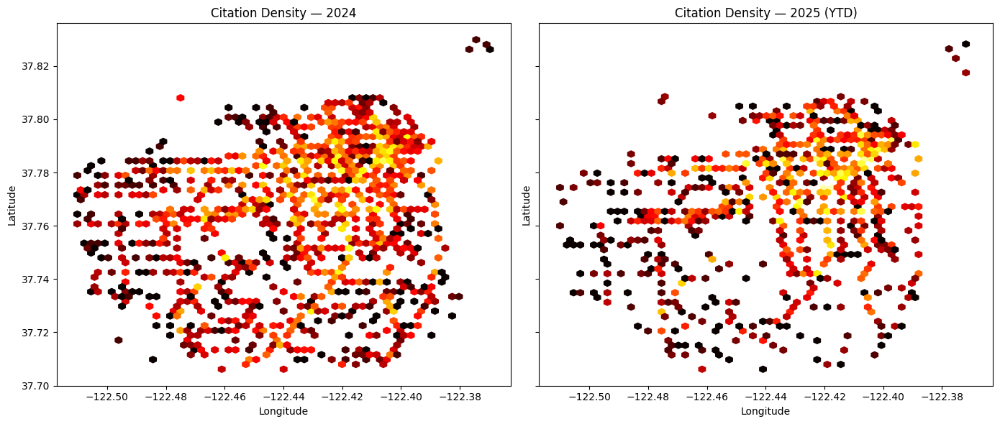
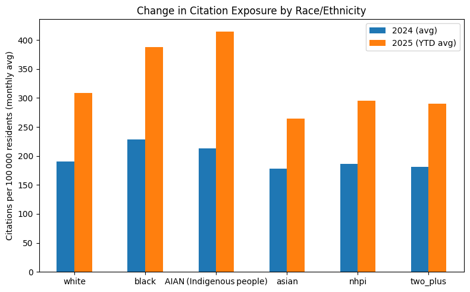

## Muni Ticketing Analysis

[See the raw research data here](./research)
 
The implications of the analysis are that the mayor's agressive strategy of mass arrests and mass ticketing are disproportionately affecting low-income neighborhoods and communities of color. Citations are up significantly since Lurie took office, with the new enforcement disproportionately targeting BIPOC populations.  

The analysis shows that the new administration is focusing on different neighborhoods than the previous administration, with a shift in enforcement patterns away from the Tenderloin and towards the Bayview and Excelsior neighborhoods. The Mission is also seeing a significant increase in citations, along with the very public spectacle of mass arrests of dozens and hundreds of people with almost all the cases being thrown out due to a lack of any evidence.  

### Results:

Enforcement is way up; near triple what it was when Lurie took office.  

  

The time of day when enforcement has happened has changed significantly. Instead of targeting morning commuters, Lurie has shifted the attention of his enforcers to the afternoon and evening crowds. This is a significant change in the way that enforcement is being done, and it has implications for the communities that are being targeted.  

  

It's easy to see that enforcement has moved, but what does it mean? Who is affected by these changes?  

  

Enforcement is up for all racial groups, but white communities are seeing very little of this growth in enforcement, while the vast majority of the new enforcement is targeting minority racial groups.  

  

As a share of new enforcement per capita, the largest portion of the growth is targeting Indigenous communities, and then black communities.  

  

